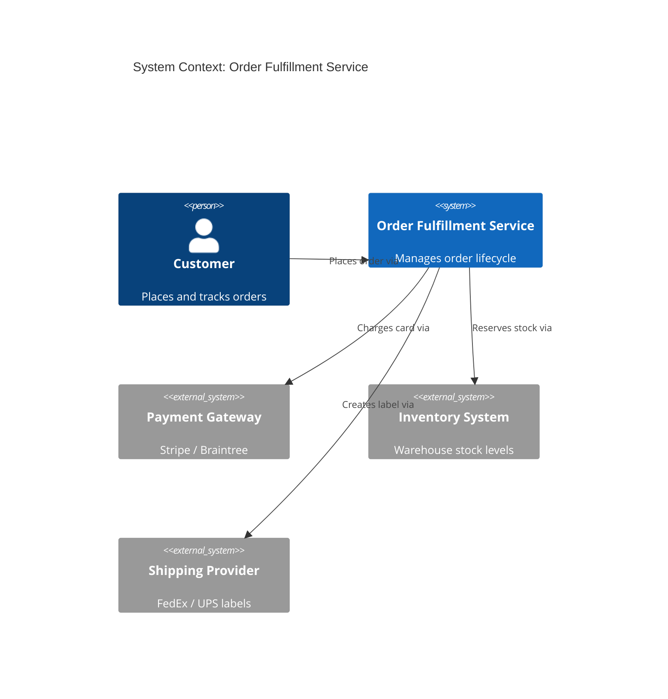
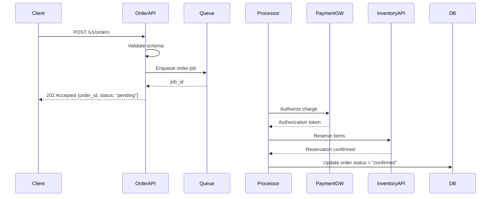
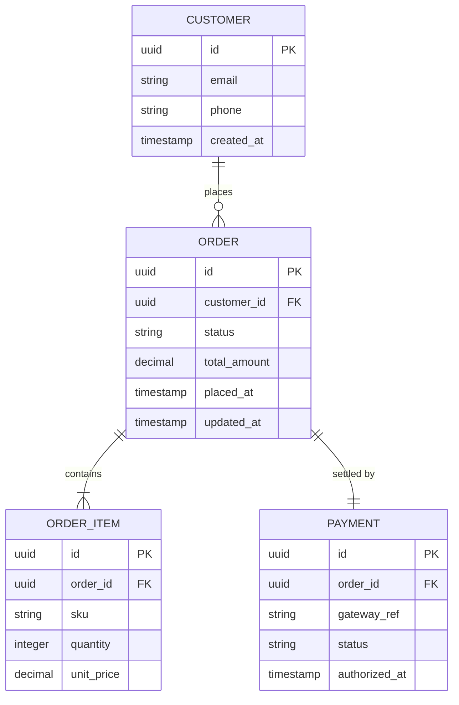
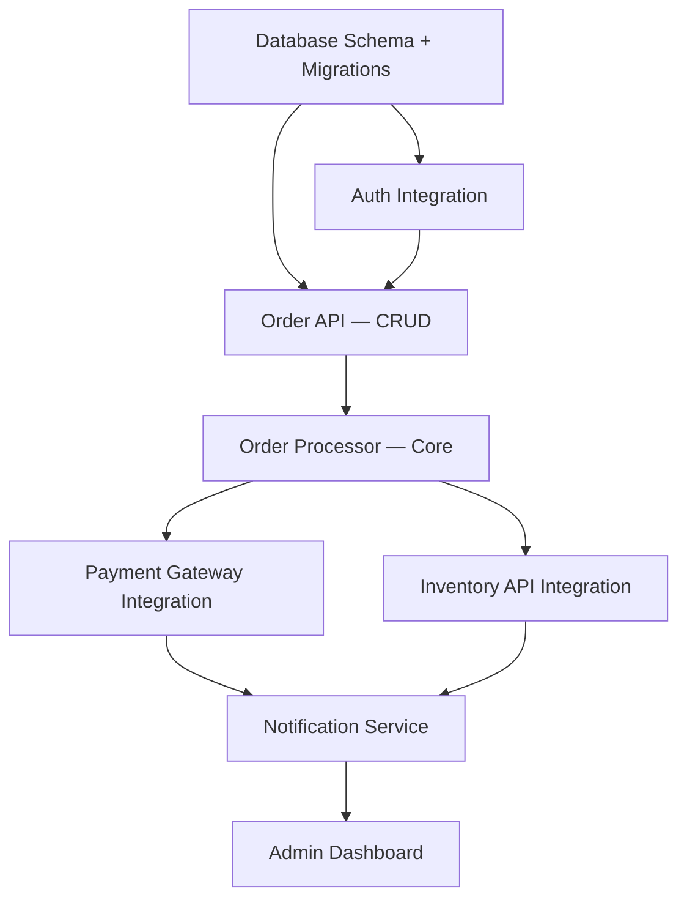

# TDD Template — Full Example

This is a fleshed-out Technical Design Document template with inline guidance.

---

# Technical Design Document: [Feature/System Name]

> **Status:** Draft | Review | Approved  
> **Author:** [Name]  
> **Last Updated:** [Date]  
> **PRD Reference:** [Link or "N/A"]

---

## 1. Overview

[2–4 sentences. What problem does this solve? Who uses it? What is the core value delivered?]

Example:
> The Order Fulfillment Service handles the end-to-end lifecycle of customer orders — from placement through payment, inventory reservation, and shipping label generation. It replaces a monolithic flow that cannot scale beyond 500 req/s and lacks observability.

---

## 2. Goals & Non-Goals

### Goals
- [Specific outcome 1, e.g., "Support 5,000 order placements/minute at p99 < 200ms."]
- [Specific outcome 2]
- [Specific outcome 3]

### Non-Goals
- [Explicit exclusion 1, e.g., "This design does NOT include returns/refund flows — addressed in PRD v2."]
- [Explicit exclusion 2]

---

## 3. System Architecture

### Narrative

[2–3 paragraphs describing the high-level shape of the system. Mention key components and how data flows through them.]

### C4 System Context Diagram



### Component Breakdown

| Component | Responsibility | Tech |
|---|---|---|
| Order API | Accept and validate order requests | Node.js / Express |
| Order Processor | Orchestrate payment + inventory | Python / Celery |
| Notification Service | Email/SMS confirmations | Go / SES |
| Admin Dashboard | Internal order management UI | React |

---

## 4. Sub-System Design

### 4.1 Order API

**Responsibility:** Accept inbound order requests, validate input, enqueue for processing.

**Key Interfaces:**

| Method | Path | Description |
|---|---|---|
| POST | /v1/orders | Create a new order |
| GET | /v1/orders/{id} | Retrieve order status |
| PATCH | /v1/orders/{id}/cancel | Cancel an order |

**Request Schema (POST /v1/orders):**
```json
{
  "customer_id": "uuid",
  "items": [{ "sku": "string", "quantity": "integer" }],
  "shipping_address": { "street": "string", "city": "string", "zip": "string" },
  "payment_method_id": "string"
}
```

**Sequence Diagram — Order Placement:**



---

### 4.2 Order Processor

**Responsibility:** Consume queued jobs, orchestrate payment + inventory, emit events.

**Complexity:** L (Large — 3–4 engineer-weeks)

**Failure Modes & Mitigations:**

| Failure | Mitigation |
|---|---|
| Payment gateway timeout | Retry with exponential backoff (max 3x), then mark as "payment_failed" |
| Inventory unavailable | Release payment auth, notify customer, set status "backordered" |
| Processor crash mid-flight | Jobs are idempotent — safe to reprocess from queue |

---

## 5. Data Model



**Key Indexes:**
- `orders(customer_id, placed_at)` — customer order history queries
- `orders(status, placed_at)` — ops dashboard filtering
- `order_items(sku)` — inventory reporting

**Data Retention:** Orders retained for 7 years (financial compliance). PII fields encrypted at rest (AES-256).

---

## 6. API Contracts

### Auth Model
All endpoints require Bearer token (JWT) issued by the Auth Service. Scopes:
- `orders:write` — required for POST, PATCH
- `orders:read` — required for GET

### Rate Limits
- Customer-facing: 60 req/min per customer_id
- Admin: 600 req/min per service account

### Error Envelope
```json
{
  "error": {
    "code": "INVENTORY_INSUFFICIENT",
    "message": "One or more items are out of stock.",
    "details": [{ "sku": "ABC-123", "available": 0, "requested": 5 }]
  }
}
```

---

## 7. Implementation Plan

### Dependency Graph



### Phases

**Phase 1 — MVP (Weeks 1–6)**
- Database schema + migrations
- Order API (create, get)
- Order Processor (happy path: payment + inventory)
- Email notifications (order confirmed)

**Phase 2 — Hardening (Weeks 7–10)**
- Cancellation flow
- Retry / dead-letter queue
- Admin dashboard (basic)
- Load testing to 5k req/min

**Phase 3 — Polish (Weeks 11–14)**
- SMS notifications
- Advanced admin filters
- Returns/refunds (pending PRD v2)

### Sizing

| Sub-system | Estimate | Team |
|---|---|---|
| Order API | M (1–2 weeks) | Backend |
| Order Processor | L (3–4 weeks) | Backend |
| Notification Service | S (< 1 week) | Backend |
| Admin Dashboard | M (1–2 weeks) | Frontend |

---

## 8. Decision Log

| Decision | Options Considered | Chosen | Rationale |
|---|---|---|---|
| Message queue | SQS, RabbitMQ, Kafka | SQS | Managed, scales automatically, sufficient for < 10k msg/s |
| Database | PostgreSQL, MySQL, DynamoDB | PostgreSQL | ACID compliance needed for financial data; team expertise |
| Payment gateway | Stripe, Braintree, Adyen | Stripe | Faster integration, best SDK quality, existing account |
| Orchestration | Saga pattern, 2PC | Saga (choreography) | Avoids distributed locking; better fault isolation |
| Auth | Build, Auth0, Cognito | Auth0 | Faster time-to-market, handles edge cases, OIDC compliant |

---

## 9. Open Questions

1. **Inventory system API:** Does the existing inventory API support batch reservation? If not, we need a workaround or a new endpoint from the Inventory team. **Owner:** [TBD] **Due:** [Date]
2. **SLA target:** Is p99 < 200ms measured at the load balancer or at the client? Affects where we add tracing.
3. **PII encryption:** Should we use envelope encryption (per-record keys) or field-level encryption at the app layer? Awaiting Security team input.

---

## 10. Appendix

### Glossary
- **SKU** — Stock Keeping Unit. Unique product identifier.
- **Saga** — Distributed transaction pattern using a sequence of local transactions with compensating actions on failure.
- **p99** — 99th percentile latency. 99% of requests complete within this time.

### References
- [Stripe API Docs](https://stripe.com/docs/api)
- [Saga Pattern (microservices.io)](https://microservices.io/patterns/data/saga.html)
- [C4 Model](https://c4model.com)